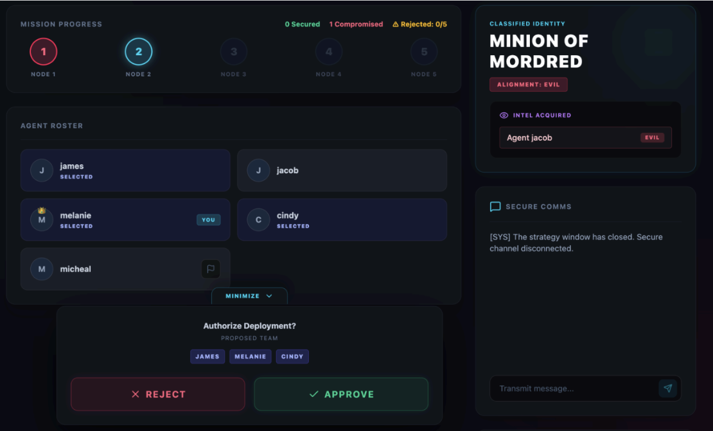
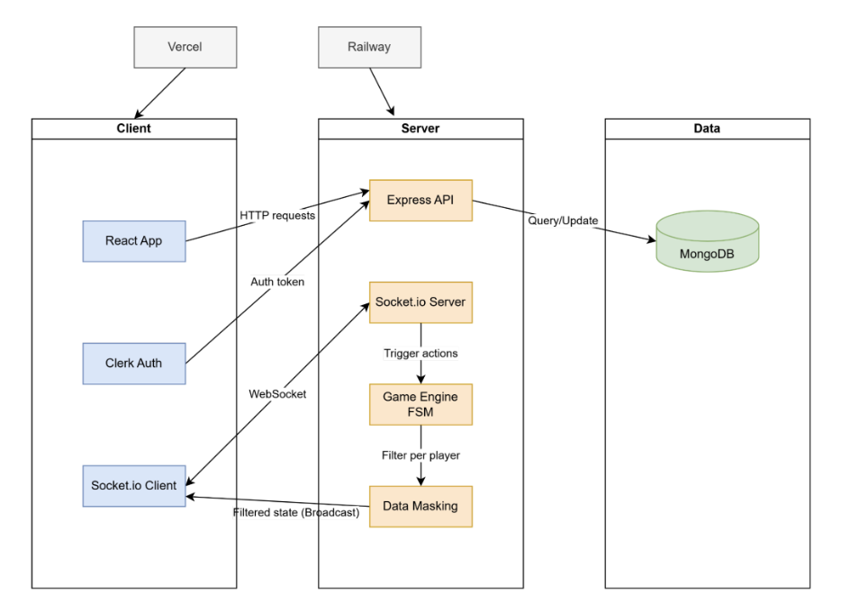
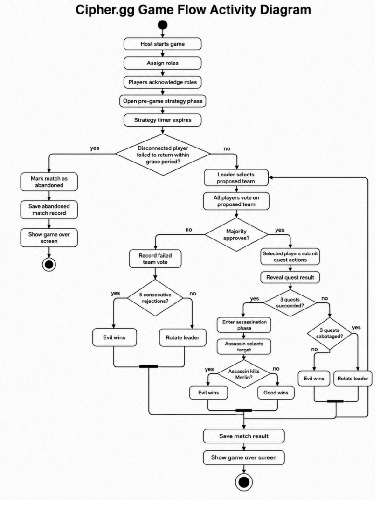
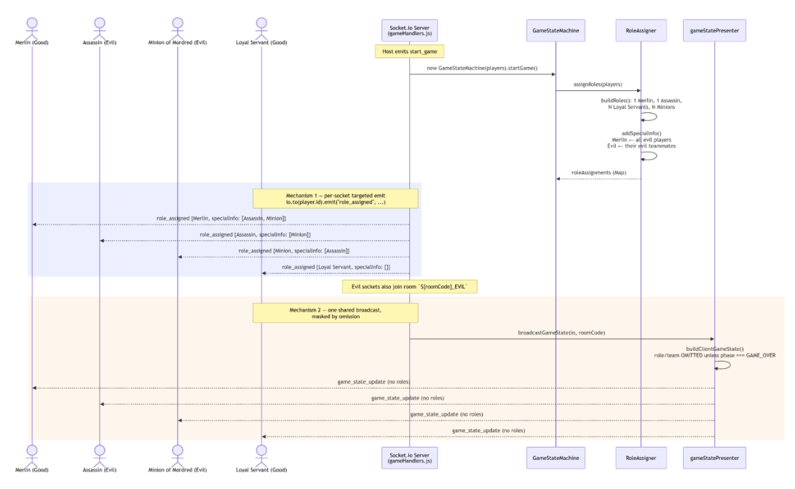
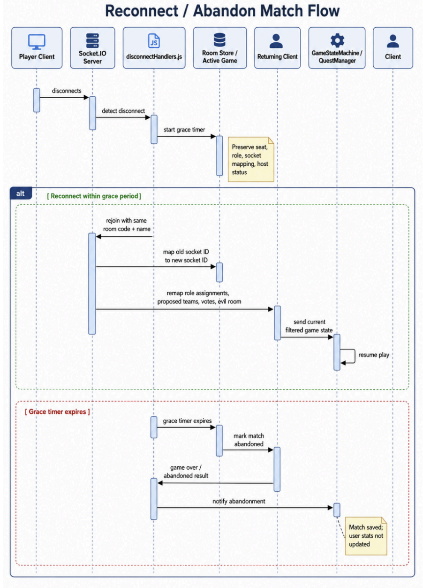
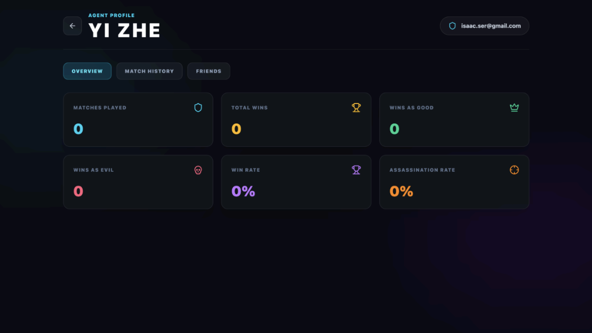

# Cipher.gg

> A real-time multiplayer platform for hidden-role social deduction games, built around an authoritative server-side game engine inspired by **The Resistance: Avalon**.

🎮 **[Live Demo](https://cipher-gg.vercel.app/)**  
📄 **[Full Technical Report](docs/CipherGG-NUS-Orbital-2026-Technical-Report.pdf)**



---

## Overview

Cipher.gg is a real-time web platform that digitises the moderator role in hidden-role social deduction games.

Instead of relying on a human moderator to manage roles, turns, voting, quests, and hidden information, Cipher.gg uses an authoritative backend game engine to coordinate the entire match.

The platform supports complete Avalon-inspired matches for **5–10 players**, including:

- Private multiplayer lobbies
- Secret role assignment
- Real-time game-state synchronisation
- Team selection and voting
- Quest execution
- Hidden-information management
- In-game chat
- Reconnection after network drops
- Match history and player statistics
- AI-assisted strategy coaching

The project was developed as part of **NUS Orbital 2026**.

---

## Engineering Highlights

Cipher.gg is more than a digital implementation of a board game. The core engineering challenge was building a reliable real-time multiplayer system where different players are intentionally allowed to see different information.

### 🎮 Authoritative Game Engine

All gameplay rules and state transitions are enforced on the backend through a finite state machine.

The frontend does not decide whether an action is valid.

### 🔐 Hidden-Information Security

Secret roles and role-specific information are controlled by the server rather than merely hidden by the React interface.

Clients are never trusted to enforce gameplay secrecy.

### ⚡ Real-Time Multiplayer

Socket.IO maintains persistent connections between players and synchronises:

- Game-state transitions
- Team proposals
- Voting
- Quest actions
- Timers
- Chat
- Match results

### 🔄 Failure Recovery

Players who temporarily disconnect can reconnect without losing their role, vote history, seat, or position in the game.

### 📊 Persistent Match Analytics

Completed matches, quest history, voting records, player statistics, and outcomes are persisted in MongoDB.

### 🧠 AI-Assisted Player Training

Player statistics and recent matches can be converted into personalised strategy insights.

If the language-model service is unavailable, Cipher.gg falls back to deterministic rules so that the training feature remains usable.

---

# System Architecture



Cipher.gg follows a client-server architecture where the backend remains the authoritative source of truth.

### Frontend

Built with **React and TypeScript** and deployed through **Vercel**.

The frontend is responsible primarily for:

- Rendering the game interface
- Collecting player interactions
- Maintaining local UI state
- Receiving real-time server updates

### Backend

Built with **Node.js, Express, and Socket.IO** and deployed through **Railway**.

The backend handles:

- Game-state orchestration
- Rule validation
- WebSocket connections
- Authentication verification
- Hidden-information control
- Match persistence
- Player statistics
- AI-assisted training insights

### Persistence

**MongoDB + Mongoose** store persistent information such as:

- User profiles
- Match records
- Quest history
- Voting history
- Player statistics
- Friend relationships

Authentication is handled using **Clerk**.

---

# Authoritative Game Engine



The core game loop is implemented as a backend **finite state machine (FSM)**.

A match progresses through states such as:

```text
LOBBY
  ↓
ROLE_ACKNOWLEDGEMENT
  ↓
PRE_GAME_STRATEGY
  ↓
TEAM_SELECTION
  ↓
TEAM_VOTING
  ↓
QUEST_EXECUTION
  ↓
QUEST_RESULT
  ↓
...
  ↓
ASSASSINATION_PHASE
  ↓
GAME_OVER
```

Incoming actions must pass server-side validation before they can modify the match.

For example:

- Only the current leader can propose a team during `TEAM_SELECTION`
- Votes are accepted only during `TEAM_VOTING`
- Only selected quest members can submit quest actions
- Good-aligned players cannot submit a Sabotage action
- Only the Assassin can submit an assassination target
- Out-of-phase or duplicate actions are rejected

This prevents the frontend from becoming responsible for enforcing game rules and makes illegal state transitions significantly harder to perform through a modified client.

---

# Hidden Information & Server Trust Model



Hidden information is a fundamental part of social deduction games.

Simply hiding information in the React interface would not be sufficient because users could inspect browser state or network traffic.

Cipher.gg therefore assumes that a client can potentially be inspected or modified.

At game start, role-specific information is delivered directly to the relevant player's Socket.IO connection.

For example:

- **Merlin** receives information about Evil players
- **Evil players** receive information about their teammates
- **Loyal Servants** receive no additional player identities

During gameplay, shared game-state broadcasts deliberately exclude hidden roles.

The important security boundary therefore exists on the **server**, not in the UI.

---

# Core Features

| Feature | Description |
| --- | --- |
| **Multiplayer Lobby** | Players create or join private rooms using room codes, configurable lobby sizes, and ready states. |
| **Automated Game Master** | Backend FSM controls the entire Avalon-inspired match without requiring a human moderator. |
| **Role Assignment** | Players receive secret roles and role-specific information through server-controlled delivery. |
| **Real-Time Chat** | Socket.IO powers lobby and in-game discussion, including a restricted Evil-team strategy channel. |
| **Dynamic Game Dashboard** | Players receive live mission state, roster information, actions, timers, role information, and personal notes. |
| **Endgame Summary** | Reveals roles and explains the final outcome after the match ends. |
| **Reconnection System** | Temporarily disconnected players can rejoin an existing match without being treated as new players. |
| **Interactive Tutorial** | New players are guided through the actual interface using context-aware tutorial overlays. |
| **Match History** | Players can review previous games, quest results, roles, voting patterns, and outcomes. |
| **Player Training Dashboard** | Converts player statistics and recent match history into personalised strategic insights. |
| **Friends System** | Signed-in players can search for users, send requests, and maintain friendships. |

---

# Handling Player Reconnection



Real-time multiplayer systems need to handle more than the ideal case where every connection remains stable.

When a player disconnects, Cipher.gg does not immediately remove them from the game.

Instead, the server temporarily preserves their state while waiting for them to reconnect.

A returning Socket.IO connection receives a new socket ID, so the backend must remap the player's existing state to the new connection.

This includes information such as:

- Player seat
- Secret role
- Host status
- Proposed teams
- Previous votes
- Game state
- Restricted chat membership

Players receive a longer reconnection grace period during an active game than while waiting in a lobby.

If the player fails to return within the allowed period, the match is marked as **abandoned** rather than incorrectly recording a win or loss.

Abandoned matches are excluded from player statistics.

---

# Player Training Dashboard



Cipher.gg extends beyond simply storing match history.

Signed-in players can review:

- Matches played
- Wins as Good
- Wins as Evil
- Win rate
- Assassination performance
- Recent match outcomes
- Roles played
- Quest results

The **Training** section also uses a player's statistics and recent match history to generate personalised strategy suggestions.

The backend prepares a structured summary of recent player performance and can send it to a language model for strategy coaching.

If the AI request fails or an API key is unavailable, a deterministic fallback system generates recommendations from the same player statistics.

This allows the feature to degrade gracefully rather than becoming unusable when an external AI service is unavailable.

---

# Tech Stack

### Frontend

- React
- TypeScript
- Vite
- Tailwind CSS
- Socket.IO Client
- Framer Motion
- Clerk

### Backend

- Node.js
- Express
- Socket.IO
- Mongoose
- OpenAI API

### Data & Infrastructure

- MongoDB
- Vercel
- Railway
- GitHub Actions

### Testing

- Jest
- Socket.IO integration testing
- ESLint
- Vite production build checks

---

# Testing & Quality Assurance

Because bugs in the backend game engine can change the outcome of a match or expose hidden information, testing focuses primarily on high-risk system behaviour rather than only UI behaviour.

Automated tests cover areas including:

- Role distribution
- Good/Evil team ratios
- Game-state transitions
- Invalid player actions
- Team voting
- Quest resolution
- Win conditions
- Assassination logic
- 5–10 player lobby boundaries
- Quest 4 special rules
- Five consecutive rejected teams
- Player reconnection
- Match persistence
- User-statistics updates

Integration tests simulate complete Socket.IO game flows using multiple clients, including **5-, 7-, and 10-player games**.

The test suite also verifies that completed matches are correctly persisted to MongoDB and that player statistics are updated after a match.

---

# CI/CD

Cipher.gg uses **GitHub Actions** as an automated quality gate.

Changes to the project run checks including:

- Backend Jest tests
- Frontend ESLint validation
- Frontend production builds

After changes are merged into `main`:

- **Vercel** deploys the frontend
- **Railway** deploys the backend

This keeps the deployed version aligned with the main branch.

---

# Software Engineering Practices

Cipher.gg was developed using a structured collaborative workflow.

### Feature Branching

New features and fixes were developed on dedicated branches rather than directly on `main`.

### Pull Requests & Peer Review

Changes were merged through pull requests so that code could be reviewed before reaching production.

### Modular Architecture

The game engine is split into focused modules including:

- `GameStateMachine`
- `RoleAssigner`
- `QuestManager`
- `AssassinationManager`
- Game-state presentation logic

Socket.IO handlers act as the interface between network events and the internal game engine.

This separation keeps the game rules independent from the frontend and makes individual pieces of game logic easier to test.

---

# Known Limitations

Cipher.gg currently stores active lobby and match state in the backend server's memory.

This is sufficient for the current deployment and allows individual players to reconnect, but a complete server restart would still terminate an active match.

A future version could move active state into a shared external store such as **Redis**, enabling:

- Game recovery after server restarts
- Shared state across multiple backend instances
- Horizontal scaling

Frontend browser automation is another area for future improvement.

While backend behaviour and Socket.IO integration are covered by automated tests, interactive frontend behaviour is currently validated primarily through linting, build checks, and manual testing.

A future **Playwright or Cypress** suite could automate multi-client browser scenarios.

---

# Project Context

Cipher.gg was built by:

- **Jerry Wong Sing Zhe**
- **Ser Yi Zhe**

as a two-person project for **NUS Orbital 2026**, targeting the **Artemis** level of achievement.

The project evolved across three development milestones:

**MS1** — Core lobby, joining flow, and initial gameplay prototype  
**MS2** — Complete 5–10 player game engine, role privacy, real-time chat, and endgame flow  
**MS3** — Reconnection, onboarding, match history, player analytics, AI-assisted training, and additional engineering/testing work

---

# Documentation

For the full technical discussion — including architecture decisions, feature design, trade-offs, sequence diagrams, testing strategy, user testing, and known limitations — see:

📄 **[Cipher.gg — NUS Orbital 2026 Technical Report](docs/CipherGG-NUS-Orbital-2026-Technical-Report.pdf)**

🎮 **[Try Cipher.gg](https://cipher-gg.vercel.app/)**

---

## License

This project is licensed under the terms provided in the repository's [LICENSE](LICENSE) file.